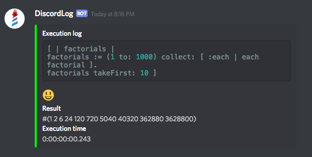

# Discord Log

A simple application that executes a time-consuming code block and sends a notification to a given Discord channel (or as direct message) with return value, execution time, and the code block that was executed.

This tool was implemented during a practical session of Pharo Club held after a tech talk by [Juraj Kubelka](https://github.com/JurajKubelka): [DiscordSt: API & Pharo Integration](https://youtu.be/Rvq2iKY7YWQ).

## Dependencies
This application is based on DiscordSt. So you must first install it

```Smalltalk
Metacello new
   baseline: #DiscordSt;
   repository: 'github://JurajKubelka/DiscordSt:dev/src';
   load.
```

## Example usage

```Smalltalk
url := 'https://discordapp.com/api/webhooks/<your webhook id>'.
log := PCDiscordLog withWebhook: url.

"Your time-consuming code"
block := [
   | factorials |
	
   factorials := (1 to: 1000) collect: [ :each |
      each factorial ].
	
   factorials takeFirst: 10
].

log timeItAndNotify: block.
```

## Notification on Discord

